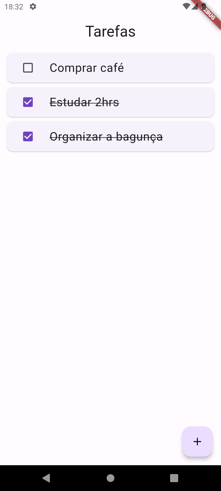

## Projeto de teste em Flutter
App de lista de tarefas implementanto gerenciamento de estado com Mobx e salvando a lista com sqlite

Ações:
- Adicionar tarefa com o botão +
- Marcar tarefas como concluidas / não concluidas
- Deletar tarefas arrastando para os lados

